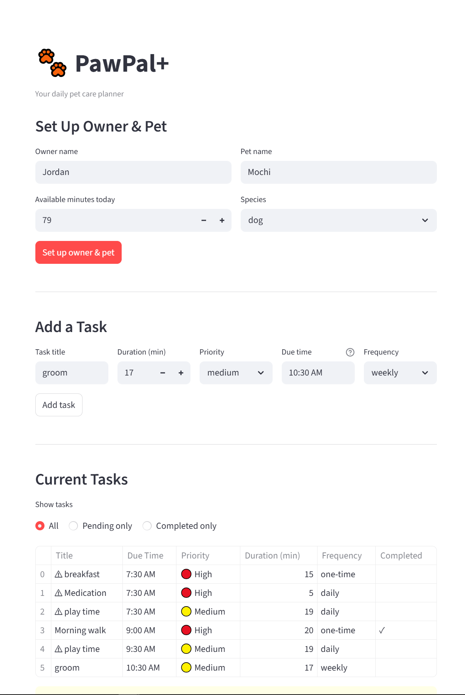
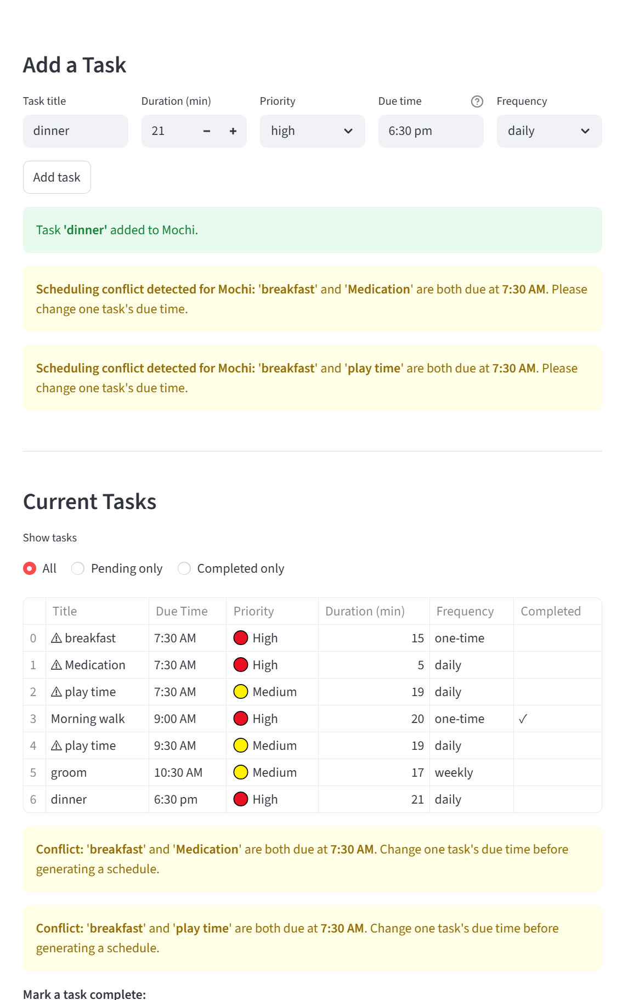
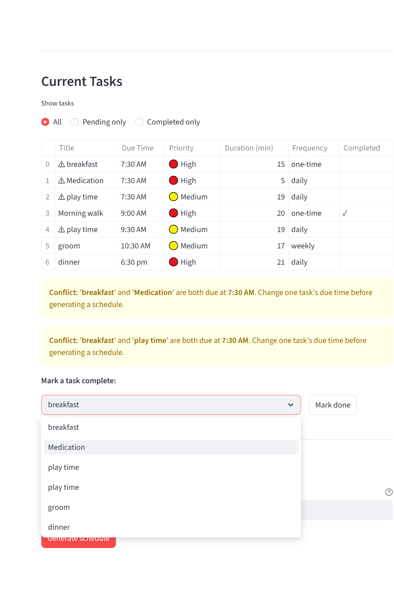
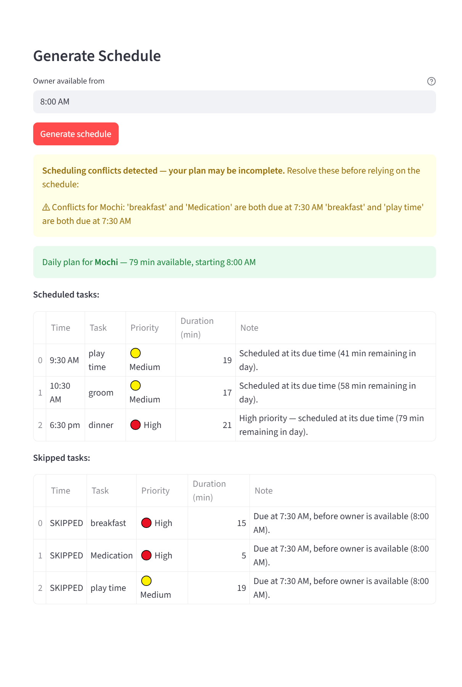

# PawPal+ (Module 2 Project)

You are building **PawPal+**, a Streamlit app that helps a pet owner plan care tasks for their pet.

## Scenario

A busy pet owner needs help staying consistent with pet care. They want an assistant that can:

- Track pet care tasks (walks, feeding, meds, enrichment, grooming, etc.)
- Consider constraints (time available, priority, owner preferences)
- Produce a daily plan and explain why it chose that plan

Your job is to design the system first (UML), then implement the logic in Python, then connect it to the Streamlit UI.

## Features

### Task Management
- **Add & remove tasks** — Assign pet care tasks (walks, feeding, medication, grooming, etc.) to any pet with title, duration, priority, due time, and frequency
- **Priority labeling** — Each task is tagged `high`, `medium`, or `low`; a numeric priority value (`high=3`, `medium=2`, `low=1`) drives scheduling decisions
- **Task completion** — Mark tasks done with one click; the task history is preserved and filterable

### Sorting
- **Chronological sort by time** — `Scheduler.sort_by_time()` converts 12-hour time strings (e.g. `"9:00 AM"`) to `datetime` objects before sorting, preventing the alphabetic bug where `"10:00 AM"` would appear before `"9:00 AM"`; tasks with unrecognized times are pushed safely to the end

### Filtering
- **Multi-criterion task filter** — `Scheduler.filter_tasks()` accepts an optional completion status (`True`/`False`) and an optional pet name; both filters are ANDed, so you can ask for "Mochi's pending tasks" in a single call

### Conflict Detection
- **Same-time conflict warnings** — `Scheduler.find_conflicts()` uses an O(n) hash-table scan to detect tasks sharing the same `due_time` for a given pet; conflicts are surfaced as `(task_a, task_b)` pairs and displayed in the UI with a `⚠` indicator before the schedule is generated
- **Human-readable conflict summary** — `Scheduler.conflict_summary()` formats warnings into plain English so the user knows exactly which tasks clash

### Recurring Tasks
- **Daily & weekly recurrence** — `Task.next_occurrence()` uses Python `timedelta` arithmetic to compute the correct next date (`+1 day` for daily, `+7 days` for weekly)
- **Auto-scheduling on completion** — When `Scheduler.mark_task_complete()` is called on a recurring task, the next occurrence is automatically created and appended to the pet's task list — no manual re-entry required
- **Safe reset** — `Task.reset()` clears the `completed` flag on recurring tasks only; one-time tasks are left unchanged

### Smart Daily Scheduling (`build_plan`)
- **Priority-first budget allocation** — High-priority tasks claim time budget before medium and low; within the same priority, shorter tasks are scheduled first (duration as a tie-breaker)
- **Start-time gating** — Tasks due before the owner's available start time are marked skipped with a specific reason rather than silently dropped
- **Budget enforcement** — The scheduler tracks remaining minutes and skips any task whose duration exceeds what is left, reporting exactly how many minutes were available vs. needed
- **Chronological output** — The final plan re-sorts all scheduled tasks by due time so the daily view always reads in order
- **Explainable decisions** — Every `ScheduledTask` carries a `reason` string (e.g. "High priority — scheduled at its due time (45 min remaining)") so the user understands why each task was included or skipped

### Multi-Pet Support
- **Per-pet isolation** — Conflict detection and schedule generation operate on a single named pet; tasks and conflicts never bleed between pets
- **Aggregate view** — `Owner.get_all_pending_tasks()` flattens pending tasks across all pets for a global overview

---

## What you will build

Your final app should:

- Let a user enter basic owner + pet info
- Let a user add/edit tasks (duration + priority at minimum)
- Generate a daily schedule/plan based on constraints and priorities
- Display the plan clearly (and ideally explain the reasoning)
- Include tests for the most important scheduling behaviors

## Getting started

### Setup

```bash
python -m venv .venv
source .venv/bin/activate  # Windows: .venv\Scripts\activate
pip install -r requirements.txt
```

### Running the app

```bash
streamlit run app.py
```

### CLI demo

To see the backend logic in action without the UI:

```bash
python main.py
```

### Suggested workflow

1. Read the scenario carefully and identify requirements and edge cases.
2. Draft a UML diagram (classes, attributes, methods, relationships).
3. Convert UML into Python class stubs (no logic yet).
4. Implement scheduling logic in small increments.
5. Add tests to verify key behaviors.
6. Connect your logic to the Streamlit UI in `app.py`.
7. Refine UML so it matches what you actually built.

## Classes

### `Task`
Represents a single pet care task (e.g., "Morning walk", "Give medication").

| Attribute | Type | Description |
|---|---|---|
| `title` | `str` | Name of the task |
| `task_type` | `str` | Category (e.g. `"walk"`, `"feeding"`, `"medication"`) |
| `duration_minutes` | `int` | Estimated time to complete |
| `priority` | `str` | `"high"`, `"medium"`, or `"low"` |
| `due_time` | `str` | Time of day (e.g. `"9:00 AM"`) |
| `completed` | `bool` | Whether the task has been completed (default `False`) |
| `frequency` | `str \| None` | `"daily"`, `"weekly"`, or `None` for one-time tasks |
| `due_date` | `date \| None` | Calendar date the task is due |

Key methods: `mark_complete()`, `reset()`, `priority_value()`, `next_occurrence()`

---

### `Pet`
Represents a pet belonging to an owner. Owns a list of `Task` objects.

| Attribute | Type | Description |
|---|---|---|
| `name` | `str` | Pet's name |
| `species` | `str` | e.g. `"dog"`, `"cat"` |
| `age` | `int` | Age in years |
| `breed` | `str` | Breed description |
| `tasks` | `list[Task]` | All tasks assigned to this pet |

Key methods: `add_task()`, `remove_task()`, `list_tasks()`, `get_pending_tasks()`

---

### `Owner`
Represents the app user. Manages a list of `Pet` objects and tracks the daily time budget.

| Attribute | Type | Description |
|---|---|---|
| `name` | `str` | Owner's name |
| `phone` | `str` | Contact number |
| `available_minutes` | `int` | Total free minutes for pet care today |
| `pets` | `list[Pet]` | All pets belonging to this owner |

Key methods: `add_pet()`, `remove_pet()`, `find_pet()`, `get_all_pending_tasks()`

---

### `ScheduledTask`
Wraps a `Task` with a scheduled start time and a reason string. Produced by `Scheduler.build_plan()`. `start_time` is `None` when the task was skipped.

| Attribute | Type | Description |
|---|---|---|
| `task` | `Task` | The underlying task |
| `start_time` | `str \| None` | Assigned time, or `None` if skipped |
| `reason` | `str` | Why the task was scheduled or skipped |

Key methods: `summary()`

---

### `Scheduler`
The brain of the app. Takes an `Owner` and builds a prioritized daily care plan for a given pet based on available time, priority, and due times.

Key methods:

| Method | Description |
|---|---|
| `build_plan(pet_name, start_time)` | Returns a list of `ScheduledTask` objects in chronological order |
| `explain_plan(pet_name, start_time)` | Returns the plan as a formatted human-readable string |
| `sort_by_time(tasks)` | Sorts tasks chronologically using numeric time comparison |
| `filter_tasks(completed, pet_name)` | Filters tasks across all pets by status and/or pet name |
| `mark_task_complete(pet_name, task_title)` | Marks a task done and auto-schedules the next occurrence for recurring tasks |
| `find_conflicts(pet_name)` | Returns pairs of tasks sharing the same `due_time` |
| `conflict_summary(pet_name)` | Returns a human-readable conflict warning string |

---

## Smarter Scheduling

The scheduler goes beyond a basic plan — it can sort, filter, handle repeating tasks, and warn you when two things are scheduled at the same time.

### Sort by time
Tasks are automatically sorted by due time so the daily plan always reads in chronological order. If a task has a missing or unrecognized time, it gets pushed to the end instead of causing an error.
→ `Scheduler.sort_by_time(tasks)`

### Filter tasks
You can ask for a focused view of tasks — for example, only tasks that are still pending, only tasks for a specific pet, or both at once. This makes it easy to check what still needs to be done without scrolling through everything.
→ `Scheduler.filter_tasks(completed, pet_name)`

### Recurring tasks
Some tasks repeat every day or every week (like feeding or a morning walk). When you mark one of these complete, the scheduler automatically schedules the next occurrence on the right date — no manual re-entry needed.
→ `Scheduler.mark_task_complete(pet_name, task_title)` · `Task.next_occurrence()`

### Conflict detection
If two tasks for the same pet are due at the same time, the scheduler catches it and prints a warning before showing the daily plan. This helps you spot and fix scheduling overlaps early.
→ `Scheduler.find_conflicts(pet_name)` · `Scheduler.conflict_summary(pet_name)`

## Testing PawPal+

### Running the tests

```bash
python -m pytest
```

## 📸 Demo









The app is divided into four sections:

1. **Owner & Pet Setup** — Enter your name, daily time budget (in minutes), and your pet's info (name, species, age, breed). Hit "Save" to initialize your session.
2. **Add a Task** — Fill in a task title, duration, priority (low / medium / high), due time (e.g. `9:00 AM`), and frequency (one-time, daily, or weekly). The app immediately warns you if the new task conflicts with an existing one at the same time.
3. **Current Tasks** — View all tasks in a sortable table. Use the radio buttons to filter by All / Pending / Completed. Tasks with a scheduling conflict are flagged with a ⚠ warning. Mark any pending task complete from a dropdown — recurring tasks are automatically rescheduled.
4. **Generate Schedule** — Enter a start time and click "Generate schedule" to see a prioritized daily plan. The output shows two tables: scheduled tasks (with time, priority, duration, and reason) and skipped tasks (with the reason they were left out).

### Overview

The suite contains **37 tests across 2 test files** (`test_pawpal.py` and `test_pawpal_extended.py`), all passing.

### What the tests cover

| Area | What is verified |
|---|---|
| **Task completion** | `mark_complete()` sets `completed=True`; `reset()` restores it only for recurring tasks |
| **Sorting correctness** | Tasks are returned in chronological order; numeric time comparison prevents `"10:00 AM"` sorting before `"9:00 AM"` |
| **Recurrence logic** | Completing a daily task creates a new task due tomorrow; weekly creates one due in 7 days; one-time tasks produce no follow-up |
| **Conflict detection** | Duplicate due times for the same pet are flagged; no false positives when times are unique |
| **Priority scheduling** | High-priority tasks claim budget first; tasks that exceed remaining time are skipped with a reason |
| **Budget boundaries** | A task that fits exactly is scheduled; a task one minute over budget is skipped |
| **Task filtering** | `filter_tasks()` correctly narrows by completion status, pet name, or both combined |
| **Multi-pet scenarios** | `get_all_pending_tasks()` aggregates across pets; conflicts and plans remain isolated per pet |

### Confidence level

**3 / 5 stars** ★★★☆☆

The test suite covers all core scheduling behaviors, edge cases on budget boundaries, recurrence, conflict detection, and multi-pet isolation — 37 tests across 2 test files, all passing. 
This is the first time I have relied heavily on AI to help write a large portion of a project, I would be cautious. The main features work, I hope I catch most edge cases or scenarios to be test.The remaining gap is UI-level integration (the Streamlit `app.py` flow is not tested).
