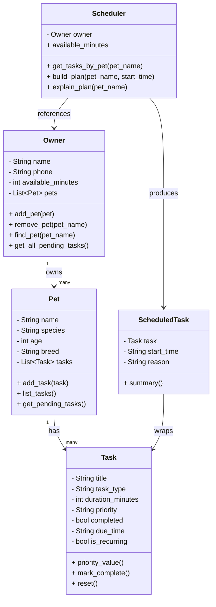

# PawPal+ Project Reflection

## 1. System Design

**a. Initial design**
- Briefly describe your initial UML design.
- What classes did you include, and what responsibilities did you assign to each?
Five classes:

- **`Owner`** — Represents the person using the app. Responsible for holding the owner's identity (name, phone), their available time budget for the day, and managing the list of pets they own. It is the entry point into the entire object graph.

- **`Pet`** — Represents a single pet. Responsible for holding identifying information (name, species, age, breed) and owning that pet's list of care tasks. The bridge between an owner and their tasks.

- **`Task`** — Represents one care item that needs to happen (e.g., morning walk, medication). Responsible for holding all task details: what it is, how long it takes, how urgent it is, when it's due, and whether it has been completed. It also knows how to convert its own priority to a number for sorting, mark itself complete, and reset itself for recurring use.

- **`Scheduler`** — The brain of the app. Responsible for retrieving a pet's pending tasks, sorting them by priority, fitting them into the owner's available time budget, and producing a structured daily plan. It does not hold task data itself — it reads from Owner and Pet to do its work.

- **`ScheduledTask`** — Represents the output of one scheduling decision. Responsible for wrapping a Task with the time it was assigned (or marking it skipped) and recording the reason for that decision. It is what gets displayed to the user as the final schedule.

**Three Core User Actions:**

1. Add and manage pets and owner info
A user can enter their own name, phone number, and available time for the day, then add one or more pets by providing each pet's name, species, age, and breed. They can also add or remove pets from their profile as needed.

2. Add and manage care tasks
A user can create care tasks for a specific pet by specifying the task name, type (e.g., walk, feeding, medication), estimated duration in minutes, priority level, and due time. Once a task is done, they can mark it as complete. For recurring daily tasks like feeding, they can reset a completed task so it appears again the next day.

3. Generate and view today's daily schedule
A user can select a pet and ask the system to generate a prioritized daily plan based on the owner's available time and that pet's pending tasks. The system fits as many tasks as possible within the time budget, starting with the highest priority, and produces a clear schedule showing what is planned, what was skipped, and a brief explanation of why each decision was made.

**Building Blocks (Classes):**

| Class | Attributes | Methods |
|---|---|---|
| `Owner` | `name`, `available_minutes`, `phone`, `pets` | `add_pet()`, `remove_pet()`, `find_pet()`, `get_all_pending_tasks()` |
| `Pet` | `name`, `species`, `age`, `breed`, `tasks` | `add_task()`, `list_tasks()`, `get_pending_tasks()` |
| `Task` | `title`, `task_type`, `duration_minutes`, `priority`, `completed`, `due_time`, `is_recurring` | `priority_value()`, `mark_complete()`, `reset()` |
| `Scheduler` | `owner`, `available_minutes` (property) | `get_tasks_by_pet(pet_name)`, `build_plan(pet_name, start_time)`, `explain_plan(pet_name)` |
| `ScheduledTask` | `task`, `start_time`, `reason` | `summary()` |

**UML Class Diagram:**



**b. Design changes**

- Did your design change during implementation?
- If yes, describe at least one change and why you made it.

Yes, the design changed in two related ways during implementation, both driven by the requirement to handle repeating tasks properly.

The first change was replacing `is_recurring: bool` on `Task` with `frequency: Optional[str]`. The original design used a simple boolean flag — a task was either recurring or it was not. This worked for resetting tasks at the end of the day, but when the requirement came in to automatically create a new instance of a task when it was marked complete, a boolean was no longer enough. The scheduler needed to know *how often* the task repeats — daily or weekly — in order to calculate the correct next due date. Changing `is_recurring` to `frequency = "daily"` or `frequency = "weekly"` (or `None` for one-time tasks) gave the field meaning beyond just true or false. `is_recurring` was kept as a derived property (`return self.frequency is not None`) so existing code did not break.

The second change was adding a `due_date` field to `Task`. The original design only stored `due_time` as a time string like `"9:00 AM"`, which was enough for single-day scheduling. Once auto-creation of next occurrences was required, the system needed to track which calendar day a task was due — not just what time. A `due_date` field using Python's `datetime.date` type was added so that `timedelta` arithmetic (`date.today() + timedelta(days=1)` for daily, `+7` for weekly) could calculate the next occurrence accurately without any manual date math.

---

## 2. Scheduling Logic and Tradeoffs

**a. Constraints and priorities**

- What constraints does your scheduler consider (for example: time, priority, preferences)?
- How did you decide which constraints mattered most?

**b. Tradeoffs**

- Describe one tradeoff your scheduler makes.
- Why is that tradeoff reasonable for this scenario?

One tradeoff in `get_all_pending_tasks()` on `Owner` is choosing the explicit loop over a more Pythonic list comprehension. The two approaches produce identical results:

```python
# Explicit loop — chosen approach
pending = []
for pet in self.pets:
    pending.extend(pet.get_pending_tasks())
return pending

# List comprehension — more Pythonic alternative
return [task for pet in self.pets for task in pet.get_pending_tasks()]
```

The list comprehension is slightly more performant because Python optimizes list comprehensions at the bytecode level, avoiding repeated `extend()` calls. However, the nested `for` clauses read left-to-right while executing outer-to-inner, which makes it harder to follow at a glance.

For a pet scheduling app where task lists are always small, the performance difference is negligible. The explicit loop was chosen because it is immediately clear to any reader what the method does — it walks each pet, collects their pending tasks, and returns the combined list. Readability was the higher priority here since the performance gain would never be noticeable in practice.

---

## 3. AI Collaboration

**a. How you used AI**

- How did you use AI tools during this project (for example: design brainstorming, debugging, refactoring)?
- What kinds of prompts or questions were most helpful?

**b. Judgment and verification**

- Describe one moment where you did not accept an AI suggestion as-is.
- How did you evaluate or verify what the AI suggested?

---

## 4. Testing and Verification

**a. What you tested**

- What behaviors did you test?
- Why were these tests important?

**b. Confidence**

- How confident are you that your scheduler works correctly?
- What edge cases would you test next if you had more time?

---

## 5. Reflection

**a. What went well**

- What part of this project are you most satisfied with?

**b. What you would improve**

- If you had another iteration, what would you improve or redesign?

**c. Key takeaway**

- What is one important thing you learned about designing systems or working with AI on this project?
